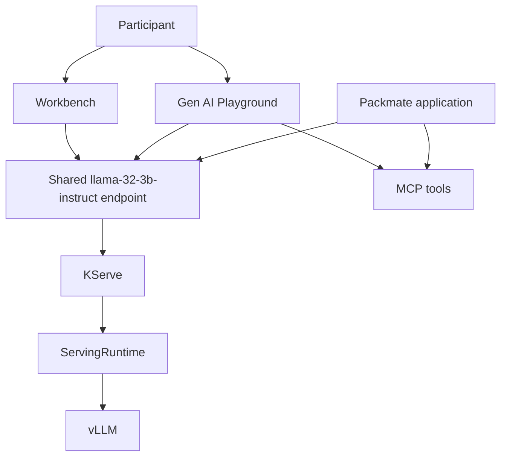

# Packmate - Build a Gen AI application with Red Hat OpenShift AI 3.5

Packmate is a beginner-friendly workshop for Data Scientists, AI Developers, Application Developers, and technical beginners who want to build with Red Hat OpenShift AI from the user perspective.

Validated on:

- OpenShift `4.20.38`
- Red Hat OpenShift AI `3.5.1`

## What this is

This workshop teaches a simple AI builder journey:

1. Create or open an OpenShift AI project and Workbench
2. Reuse a shared Llama model provided by the platform
3. Prototype in the Gen AI Playground
4. Improve results with system instructions
5. Add MCP tools for weather and baggage guidance
6. Call the same model from Python
7. Use the integrated Packmate application
8. Run a deterministic AI application regression evaluation
9. Understand the validated sandbox architecture

The workshop intentionally does **not** make participants install operators, deploy another LLM, manage GPUs, use Tekton, or perform GitOps tasks in the main hands-on path.

## Key constraints

- Targets Red Hat OpenShift AI `3.5.x`
- Reuses the shared `llama-32-3b-instruct` model
- Does **not** deploy another foundation model
- Uses the documented Playground MCP registration mechanism for OpenShift AI `3.5`
- Keeps GitHub, GHCR, Tekton, and Argo CD out of the core participant path

## Workshop duration

Plan for approximately `2` to `2.5` hours.

## Resource model

The workshop adds a small incremental footprint:

- `1` workshop namespace: `packmate-lab`
- `4` small workshop services:
  - React frontend
  - FastAPI backend
  - Weather MCP
  - Baggage Policy MCP
- no extra LLM deployment
- no extra GPU allocation

## Architecture



## Important support status

- Gen AI Playground is a Technology Preview feature in OpenShift AI `3.5`
- Custom endpoints are a Technology Preview feature in OpenShift AI `3.5`
- MCP Lifecycle Operator and MCP Catalog are Technology Preview features in OpenShift AI `3.5`
- OGX is relevant in OpenShift AI `3.5`, but this live sandbox currently validates the hands-on workshop path without enabling OGX

## Instructor flow

```bash
make preflight
make prepare-workshop
make verify-workshop
```

Or run:

```bash
make workshop-ready
```

## Main guides

- Participant guide: `workshop/PARTICIPANT_GUIDE.md`
- Instructor guide: `workshop/INSTRUCTOR_GUIDE.md`
- Architecture: `workshop/ARCHITECTURE.md`
- Troubleshooting: `workshop/TROUBLESHOOTING.md`
- Old vs new redesign: `docs/OLD_VS_NEW_WORKSHOP.md`
