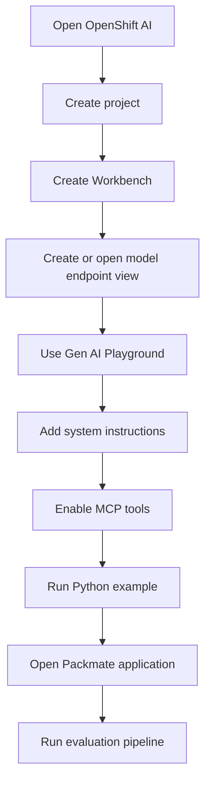
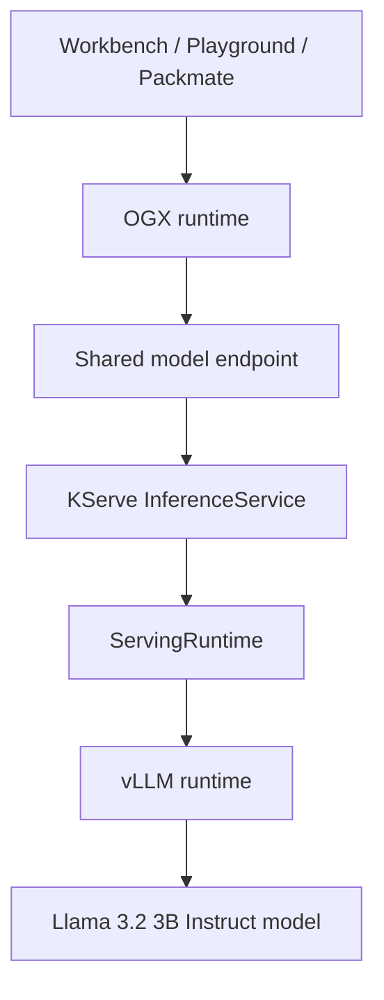
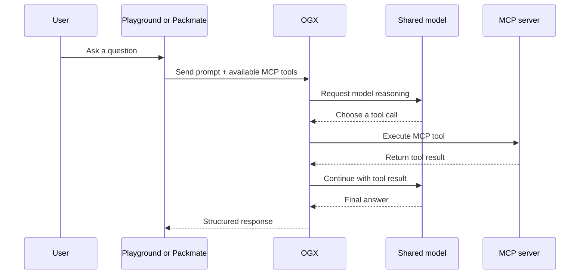
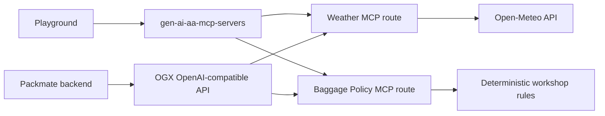
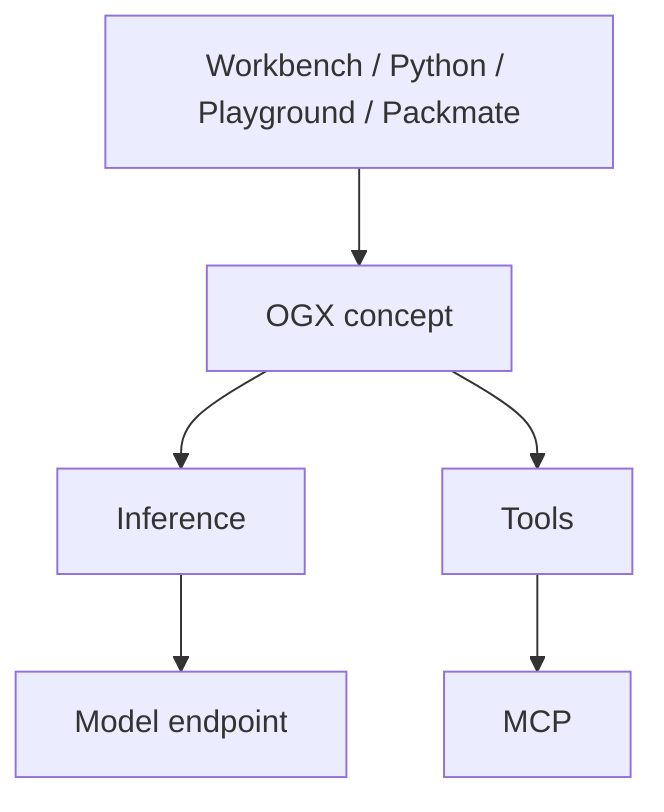
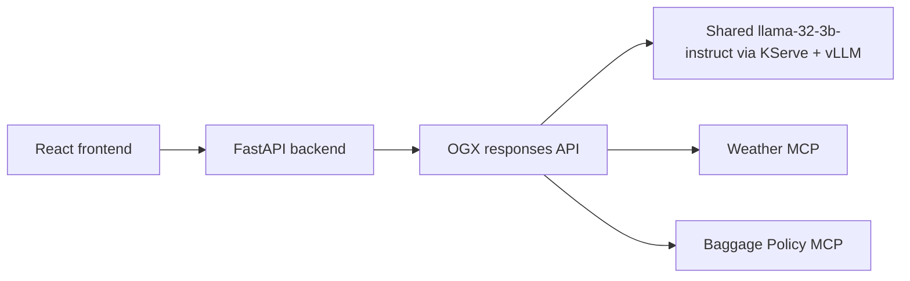
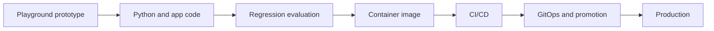

# Packmate Architecture

This workshop is validated on:

- OpenShift `4.20.38`
- Red Hat OpenShift AI `3.5.1`

## Beginner summary

Participants do not deploy a new LLM.

They reuse a shared model that already exists in the sandbox and learn how OpenShift AI helps them:

- develop in a Workbench
- experiment in Playground
- add tools with MCP
- call the same model from Python
- connect that capability to an application

## Participant workflow

## Actual serving architecture

The live sandbox uses:

- `InferenceService`: `llama-32-3b-instruct`
- `ServingRuntime`: `llama-32-3b-instruct`
- inference engine: `vLLM`
- serving layer: `KServe`

### What KServe does

KServe manages the model-serving workload on OpenShift.

### What vLLM does

vLLM loads the model and generates tokens for requests.

## MCP request flow

## Weather and baggage MCP architecture

## OGX in this workshop

OpenShift AI `3.5` introduces OGX terminology, and the live sandbox used for this workshop has OGX enabled as part of the platform layer behind Playground and the Packmate application runtime.

That means:

- OGX is relevant conceptually for `3.5`
- OGX is part of the validated runtime path for Playground in this sandbox
- OGX is also the validated primary runtime path for the Packmate backend
- participants do **not** administer OGX directly in this workshop

Beginner-level conceptual picture:

Use this as a concept map only. It does not replace the actual live serving path documented above, and it does not mean OGX replaces KServe or vLLM.

## Packmate application architecture

## Where the code lives

- `app/frontend`: React user interface
- `app/backend`: FastAPI application API and business logic
- `app/backend/app/agent/ogx_service.py`: OGX-native orchestration path
- `mcp/weather`: Weather MCP server
- `mcp/baggage`: Baggage Policy MCP server
- `examples/01_call_model.py`: simple shared-model call
- `examples/02_packmate_with_tools.py`: call the deployed Packmate API
- `pipelines/packmate-evaluation.pipeline.yaml`: pipeline definition uploaded in the project Pipelines UI

## Application runtime note

The main Packmate web application is not launched locally by the participant in
the beginner path.

Instead:

- the application is already deployed in `packmate-lab`
- the participant opens the Route
- Code Server is used to inspect code and run focused examples
- OpenShift AI Pipelines is used for the workshop evaluation flow

## Support-status note

In the validated OpenShift AI `3.5.1` environment:

- Gen AI Playground is Technology Preview
- custom endpoints are Technology Preview
- MCP Lifecycle and MCP Catalog remain Technology Preview and are not required for this workshop
- the OGX remote provider / SDK compatibility used for MCP HTTP streaming should be treated as Developer Preview

## Prototype to production

Productionization is intentionally outside the core beginner hands-on path.
