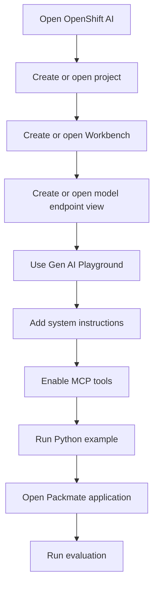
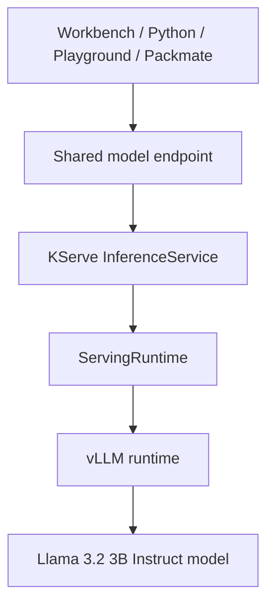
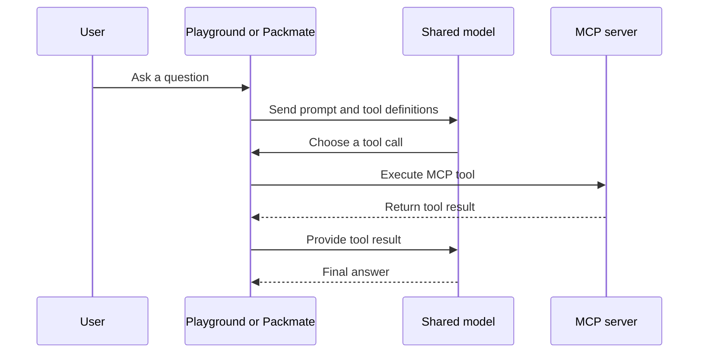
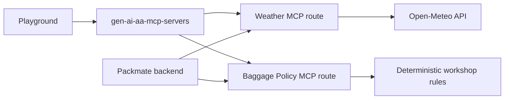
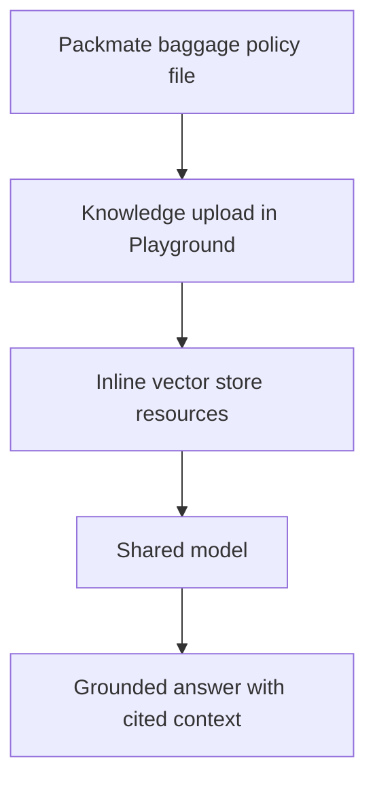
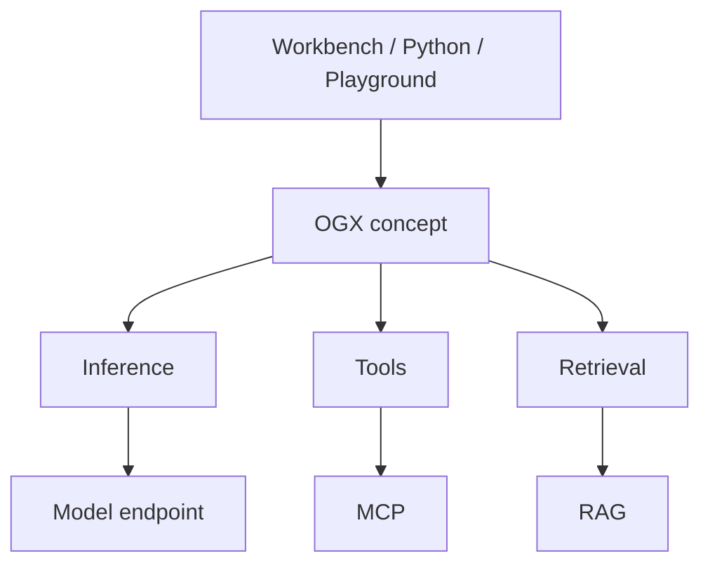
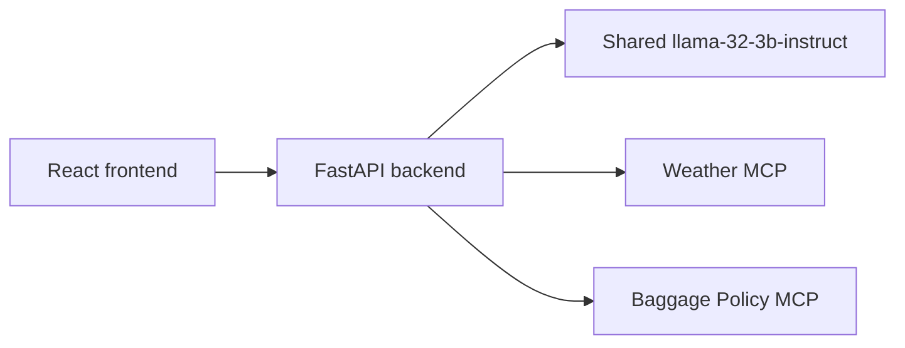
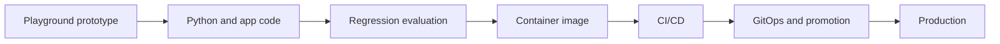

# Packmate Architecture

This workshop is validated on:

- OpenShift `4.20.38`
- Red Hat OpenShift AI `3.5.1`

## Beginner summary

Participants do not deploy a new LLM.

They reuse a shared model that already exists in the sandbox and learn how OpenShift AI helps them:

- develop in a Workbench
- experiment in Playground
- add tools with MCP
- call the same model from Python
- connect that capability to an application

## Participant workflow

## Actual serving architecture

The live sandbox uses:

- `InferenceService`: `llama-32-3b-instruct`
- `ServingRuntime`: `llama-32-3b-instruct`
- inference engine: `vLLM`
- serving layer: `KServe`

### What KServe does

KServe manages the model-serving workload on OpenShift.

### What vLLM does

vLLM loads the model and generates tokens for requests.

## MCP request flow

## Weather and baggage MCP architecture

## RAG architecture

Use this section only if the live Playground RAG flow is validated during rehearsal.

Important:

- RAG is not training
- RAG retrieves relevant context at request time

## OGX in this workshop

OpenShift AI `3.5` introduces OGX terminology, but the live sandbox used for this workshop does **not** have the `ogx` component enabled.

That means:

- OGX is relevant conceptually for `3.5`
- OGX is **not** the validated hands-on runtime path in this sandbox

Beginner-level conceptual picture:

Use this as a concept map only. It does not replace the actual live serving path documented above.

## Packmate application architecture

## Prototype to production

Productionization is intentionally outside the core beginner hands-on path.
